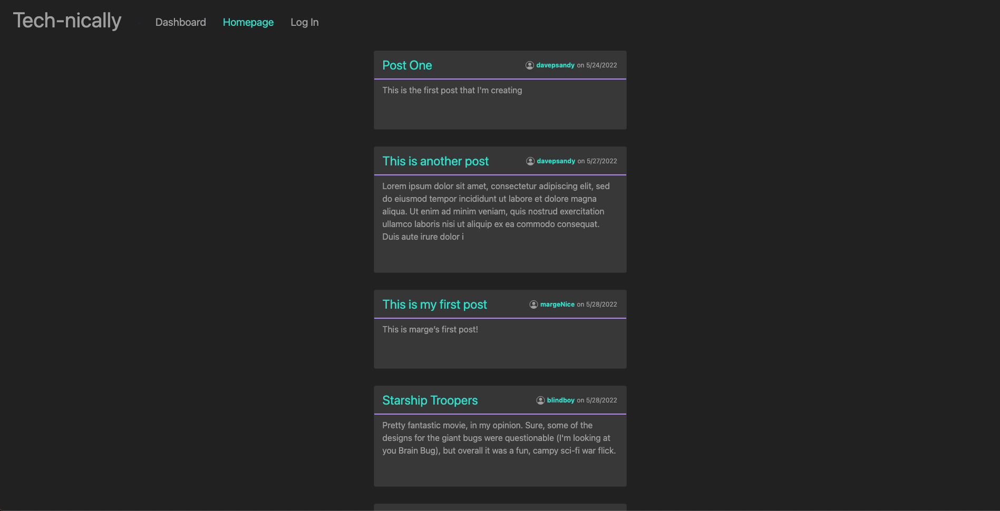

# Tech Blogger

This full stack application is a fictional tech blog, allowing users to log in and create and delete posts and comments.

## Screenshots

## Installation and Start Up

1. To install, `git clone` the repository and run `npm install` to install dependencies.

2. Create a .env file and structure it as described in .env.EXAMPLE, including your own MYSQL connection info and secret.

3. You must have MYSQL installed on your computer to use this application. Open up a connection to MYSQL in the root directory and run `source db/schema.sql` to create the database.

4. `npm start` will open a database connection and start the server, which can then be accessed in a browser at the appropriate host.

## Live Site

The site is also viewable [here](https://daves-tech-blog.herokuapp.com/).

## Technologies

This app uses:

- Handlebars as a template engine
- Express
- Node
- MYSQL
- Sequelize ORM
- Heroku for deployment
- JawsDB for hosted database
